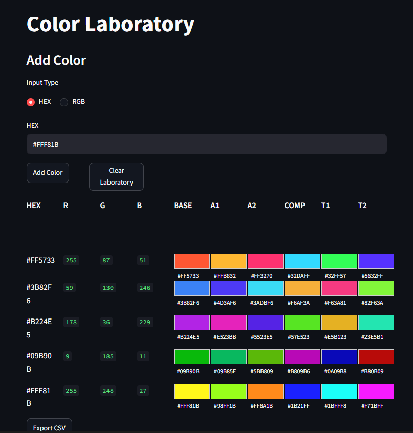

# Color Laboratory

### From color measurements to reproducible research data.

Color Laboratory is an open-source research platform for color acquisition, analysis and experimentation.

The project was created to help researchers, designers and engineers transform color measurements into structured, reproducible datasets. While many digital color tools focus on visualization or palette creation, Color Laboratory focuses on documenting color as experimental data.

The current version provides a lightweight environment for recording RGB and HEX values, generating color harmonies and exporting datasets for further analysis. Future versions will extend the platform toward computational color science, spectral reconstruction and experimental workflows.

---

# Mission

**Color Laboratory exists to transform color measurements into reproducible research data.**

Every design decision in this project follows three principles:

* **Reproducibility** – Every measurement should be traceable and repeatable.
* **Open Science** – The platform is developed openly to encourage transparency and collaboration.
* **Extensibility** – The architecture is designed to grow from simple color acquisition into a complete research environment.

---

# Why Color Laboratory?

Color is present in product design, architecture, manufacturing, lighting, healthcare and many other disciplines. Although numerous digital tools help users visualize colors or generate palettes, relatively few are designed to organize color measurements as structured experimental data.

Color Laboratory was created to fill that gap.

Rather than replacing professional color measurement equipment, the platform provides a practical environment for recording observations, organizing experiments and preparing datasets that can later be analyzed using computational methods.

The long-term objective is to support reproducible workflows that connect color acquisition with scientific analysis.

---

# Current Features

Version **0.1.0** includes:

* RGB ↔ HEX conversion
* Automatic generation of complementary, analogous and triadic color harmonies
* Multi-sample laboratory interface
* Timestamp registration
* CSV export
* Streamlit-based graphical interface
* Open-source Python implementation

These features establish the foundation for future scientific modules while remaining simple enough for educational and research use.

---

# Project Status

Color Laboratory is currently released as a **Research Prototype (v0.1.0).**

The project is under active development.

Feedback from researchers, designers, engineers and software developers is highly appreciated and will help guide future versions.

---

# Vision

The long-term goal of Color Laboratory is to become a reliable starting point for documenting, organizing and analyzing color experiments.

Future versions will integrate scientific color spaces, spectral reconstruction methods, computational models and hardware acquisition systems while maintaining reproducible research workflows.

The project is intended to evolve alongside ongoing research in color science, design and engineering.
## Screenshot

  

